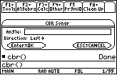
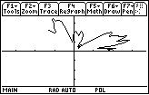

# CBR Sonar

[Info at ticalc.org](https://www.ticalc.org/archives/files/fileinfo/233/23366.html)

This program will allow you to use the TI CBR as a sonar device with a TI-89 to
plot the distance of objects from a point while the CBR rotates around this
point.

Required data are L1 and L2 (both from the CBR), angle covered during scan (in
radians), and the direction of scan (either left or right).

